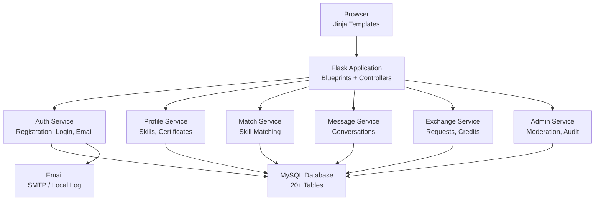

# Sahayogi

> Credit-based skill exchange platform for peer-to-peer learning


Sahayogi (meaning "helper" in Nepali) is a web-based, credit-driven skill sharing platform. Users teach skills to earn internal credits, then spend credits to learn different skills from other community members. Built with Flask, MySQL, and Jinja templates, it features secure authentication, role-based access, admin moderation, in-app messaging, video calls, and a complete credit ledger — all without real-money payment dependencies.

---

## Key Features

- **Credit-Based Exchange** — Earn credits by teaching, spend credits to learn; no real money involved
- **User Profiles** — Skills offered, skills wanted, reputation scores, certificates, and bio
- **Skill Listings** — Categories, search, filters, credit cost, and admin approval workflow
- **Exchange Requests** — Learners apply, teachers accept or reject, with credit holds
- **In-App Messaging** — Conversation threads, unread badges, and message history
- **Video Calls** — WebRTC-based video calls for active exchanges
- **Reviews & Reputation** — Post-exchange ratings with rolling reputation scores
- **Admin Dashboard** — User management, role access, listing moderation, and audit logs
- **Security** — Password hashing (scrypt), CSRF protection, account lockout, email verification
- **GDPR Account Deletion** — Users can permanently delete their accounts

---

## Architecture



---

## Tech Stack

| Layer | Technology |
|-------|-----------|
| **Backend** | Python 3.10+, Flask 3.1, Flask-Login |
| **Database** | MySQL 8.x/9.x via PyMySQL |
| **Frontend** | Jinja2, HTML, CSS, Bootstrap, Vanilla JS |
| **Authentication** | Flask-Login, scrypt password hashing, CSRF tokens |
| **Email** | SMTP (Gmail) or local file logging |
| **Video Calls** | WebRTC (signaling via database) |
| **Testing** | pytest, pytest-cov |
| **Version Control** | Git + GitHub |

---

## Installation

### Prerequisites

- Python 3.10+
- MySQL Server 8.x or 9.x
- MySQL Workbench (optional, for GUI management)

### Quick Setup (Recommended)

```bash
git clone https://github.com/13hugol/sahayogi.git
cd sahayogi/Sahayogi
python setup.py
```

The setup script will:
1. Find your MySQL installation
2. Prompt for the MySQL root password
3. Create `sahayogi` and `sahayogi_test` databases
4. Create a virtual environment and install dependencies
5. Generate `.env` configuration
6. Configure email (GSMail SMTP or local logging)
7. Create all database tables
8. Seed roles and the default admin account

### Manual Setup

```bash
git clone https://github.com/13hugol/sahayogi.git
cd sahayogi/Sahayogi

python -m venv venv
venv\Scripts\activate
pip install -r requirements.txt
```

Create `.env` from `.env.example`, then set up the database:

```sql
CREATE DATABASE sahayogi CHARACTER SET utf8mb4 COLLATE utf8mb4_unicode_ci;
CREATE DATABASE sahayogi_test CHARACTER SET utf8mb4 COLLATE utf8mb4_unicode_ci;
```

```bash
flask --app run init-db
flask --app run seed-reference-data
```

---

## Quick Start

```bash
# Start the application
python run.py

# Open in browser
# http://localhost:5000
```

### Default Admin

| Role | Email | Password |
|------|-------|----------|
| Admin | `admin@example.com` | `Admin123!` |

---

## CLI Commands

| Command | Description |
|---------|-------------|
| `python setup.py` | Full first-time setup |
| `python run.py` | Start the development server |
| `flask --app run init-db` | Create all MySQL tables |
| `flask --app run seed-reference-data` | Seed roles and default admin |
| `flask --app run elevate-user <email>` | Promote a user to admin |
| `flask --app run test-email <email>` | Send or log a test email |
| `pytest tests/ -q` | Run the test suite |

---

## Database Schema

The application manages 20+ MySQL tables including:

- **users** — Accounts with roles, credits, lockout, and suspension
- **profiles** — Username, bio, location, reputation score, certificates
- **profile_skills** — User skills (offered/wanted)
- **skills** — Published skill listings with category and credit cost
- **categories** — Skill categories with icons and ordering
- **exchange_requests** — Learner applications to skill listings
- **exchanges** — Active exchanges with completion tracking
- **credit_transactions** — Full ledger of credit earns and spends
- **credit_holds** — Pending credit holds during active requests
- **message_conversations** / **message_posts** — In-app messaging
- **notifications** — Event-driven user notifications
- **profile_reviews** — Post-exchange ratings and comments
- **reports** — User abuse reports
- **admin_audit_logs** — Admin action audit trail
- **video_call_signals** — WebRTC signaling for video calls
- **password_reset_tokens** — Secure password reset flow

---

## Project Structure

```
Sahayogi/
├── run.py                     # Entry point + startup validation
├── config.py                  # Environment-based configuration
├── setup.py                   # Automated first-time setup
├── requirements.txt           # Python dependencies
├── guide.md                   # Build rulebook and project spec
├── app/
│   ├── __init__.py            # Flask app factory
│   ├── auth.py                # Authentication logic
│   ├── commands.py            # Flask CLI commands
│   ├── database.py            # MySQL connection + table creation
│   ├── models/                # Data models (User, Profile, Skill, etc.)
│   ├── repositories/          # Database query layer
│   ├── services/              # Business logic layer
│   │   ├── auth_service.py
│   │   ├── profile_service.py
│   │   ├── skill_service.py
│   │   ├── match_service.py
│   │   ├── message_service.py
│   │   ├── notification_service.py
│   │   ├── admin_service.py
│   │   └── skill_search_service.py
│   ├── controllers/           # Route handlers
│   ├── routes/                # Flask blueprints
│   ├── validators/            # Input validation
│   ├── utils/                 # Email, tokens, helpers
│   ├── templates/             # Jinja2 HTML templates
│   └── static/                # CSS, JS, images
├── tests/                     # pytest test suite
└── Documents/                 # Project documentation
```

---

## Configuration

| Variable | Default | Description |
|----------|---------|-------------|
| `SECRET_KEY` | `dev-secret-key-change-me` | Flask secret key |
| `DATABASE_URL` | — | MySQL connection URL |
| `MYSQL_HOST` | `localhost` | MySQL host |
| `MYSQL_PORT` | `3306` | MySQL port |
| `MYSQL_USER` | `root` | MySQL username |
| `MYSQL_PASSWORD` | — | MySQL password |
| `MYSQL_DATABASE` | `sahayogi` | MySQL database name |
| `MAIL_SERVER` | — | SMTP server (e.g., `smtp.gmail.com`) |
| `MAIL_PORT` | `587` | SMTP port |
| `MAIL_USERNAME` | — | SMTP username |
| `MAIL_PASSWORD` | — | SMTP password |
| `LOCKOUT_THRESHOLD` | `3` | Failed login attempts before lockout |
| `LOCKOUT_DURATION_MINUTES` | `10` | Lockout duration |
| `WEBRTC_ICE_SERVERS` | `[]` | STUN/TURN servers for video calls |

---

## Contributing

1. Fork the repository
2. Create a feature branch (`git checkout -b feature/amazing-feature`)
3. Commit your changes (`git commit -m 'Add amazing feature'`)
4. Push to the branch (`git push origin feature/amazing-feature`)
5. Open a Pull Request

---

## License

MIT License

---

## Author

**Bhugol Gautam**
- GitHub: [@13hugol](https://github.com/13hugol)
- Email: bhugol.gautam1@gmail.com
- Computer Science Student, Softwarica College (Coventry University)
