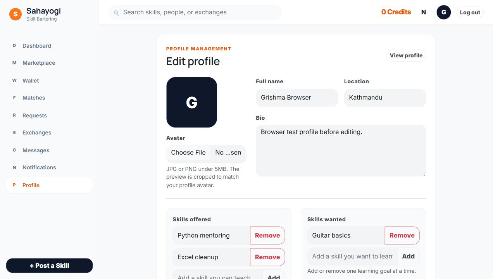
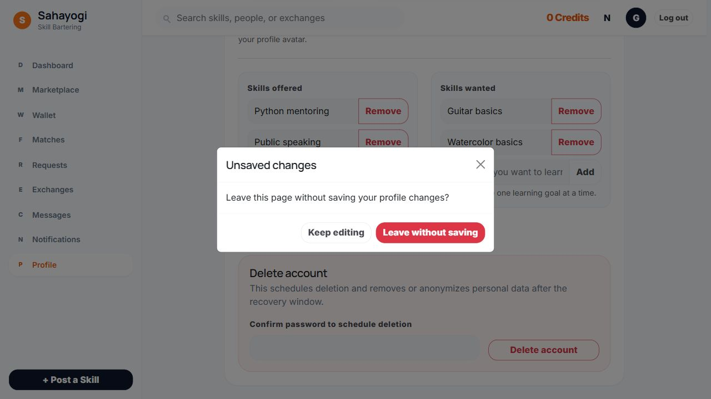
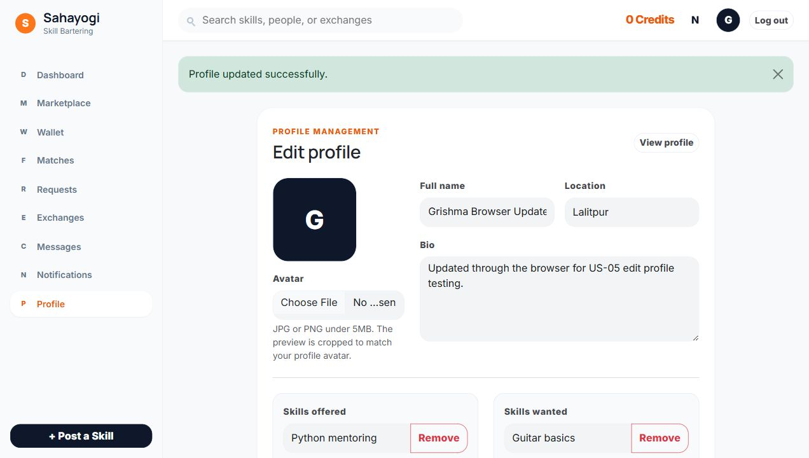
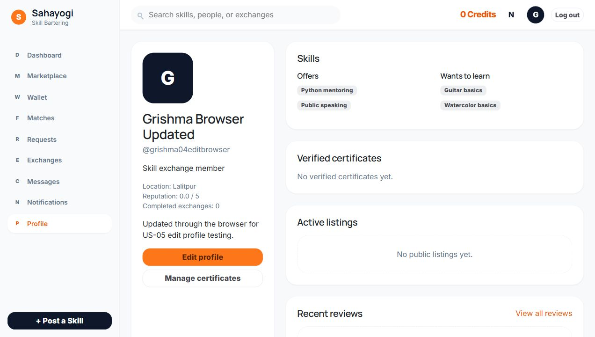

# US-05 / F2-2.2 - Edit Profile Implementation Report

## User Story

As a user, I want to edit my profile so that I can keep my information and skills up to date.

## Spreadsheet Source

- Source file: `Documents/Sahayogi_userstry (1).xlsx`
- Sheet: `Agile User Story without priori`
- Feature ID: `F2`
- Feature name: `Profile & Trust`
- User Story ID: `2.2`
- Priority: `Medium`
- Spreadsheet task wording: `edit my profile`

## Completion Status

Completed on the `Grishma` branch for the current backend scope. The edit profile story now updates persisted user/profile data, manages offered and wanted skills from the edit page, validates avatar uploads, shows a cropped avatar preview area, prompts before leaving with unsaved edits, and confirms successful saves.

## Implementation Summary

| Area | Evidence |
| --- | --- |
| Profile persistence | Added focused model methods for updating full name, location, bio, optional avatar path, and profile skills. |
| Route behavior | `/profile/edit` now supports `GET` and `POST`, requires login, validates input, saves changes, and redirects with a success flash. |
| Skill management | Offered and wanted skills can be added or removed one at a time; unchanged skill rows are preserved so linked certificate records are not cleared. |
| Avatar handling | Avatar uploads are limited to JPG/PNG files under 5MB, with extension, MIME type, file size, and header checks before save. |
| Edit UI | The form pre-fills existing data and includes individual skill rows, add controls, remove buttons, avatar input guidance, and a cropped preview area. |
| Unsaved changes | The page shows an in-app confirmation modal for dirty-form navigation and keeps native refresh/close protection as a fallback. |
| Test coverage | Added focused pytest coverage for prefill, saving, skill sync, invalid avatar rejection, and valid avatar save. |

## Acceptance Criteria Evidence

| Acceptance Criterion | Implementation Evidence |
| --- | --- |
| Edit profile form pre-fills existing data; user can update name, bio, avatar, and location. | `profile_edit()` loads the current user/profile and renders `profile/edit.html` with existing full name, bio, location, avatar state, offered skills, and wanted skills. POST saves full name, location, bio, and optional avatar path. |
| Skills offered and skills wanted can be added or removed individually without clearing other fields. | The edit page renders each skill as an individual row with a remove button plus separate add controls. `ProfileSkill.sync_for_user()` removes only deleted skills, adds new skills, and preserves unchanged rows. |
| Changes are saved with a success notification; unsaved changes prompt a confirmation before leaving. | Successful POST flashes `Profile updated successfully.` and redirects back to edit profile. `app.js` opens the `Unsaved changes` modal on dirty-form navigation and uses `beforeunload` for refresh/close protection. |
| Avatar upload accepts JPG/PNG under 5MB and displays a cropped preview before saving. | The file input accepts `.jpg`, `.jpeg`, `.png`, `image/jpeg`, and `image/png`. Backend validation rejects other files and files over 5MB. The preview container uses a fixed square with `object-fit: cover`; JavaScript swaps in the selected image before submit. |

## Files Changed

| File | Purpose |
| --- | --- |
| `app/models/user.py` | Added user full-name update and profile detail update methods. |
| `app/models/profile.py` | Added skill cleaning and skill sync behavior for offered/wanted profile skills. |
| `app/controllers/frontend_controller.py` | Implemented edit profile GET/POST flow, validation, avatar checking, avatar saving, and success flash. |
| `app/routes/frontend_routes.py` | Enabled POST requests for `/profile/edit`. |
| `app/templates/profile/edit.html` | Rebuilt the edit form around US-05 fields, skill rows, avatar preview surface, and unsaved-change modal. |
| `app/static/js/app.js` | Added edit-profile skill row controls, avatar preview behavior, and unsaved-change handling. |
| `app/static/css/app.css` | Added layout styles for the cropped avatar preview and skill editor rows. |
| `tests/test_profile.py` | Added US-05 tests for prefill, save behavior, skill sync, and avatar validation/save. |

## Browser Verification

Manual browser verification was completed through the Codex Browser plugin on May 29, 2026 against:

```text
http://127.0.0.1:5055
```

Browser test account:

```text
grishma04_edit_browser@example.com
```

Browser steps and results:

| Step | Expected Result | Actual Result | Status |
| --- | --- | --- | --- |
| Log in and open `/profile/edit`. | Edit form is accessible only after login and pre-fills existing data. | Form showed `Grishma Browser`, `Kathmandu`, existing bio, offered skills, and wanted skills. | Pass |
| Remove `Excel cleanup`, add `Public speaking`, and add `Watercolor basics`. | Skills can be changed individually without clearing name, location, or bio. | DOM showed the removed skill gone and the two new skills present while other fields remained populated. | Pass |
| Click `Cancel` with dirty form. | User is prompted before leaving with unsaved changes. | `Unsaved changes` confirmation modal appeared; `Keep editing` kept the user on `/profile/edit`. | Pass |
| Save the edit form. | Changes persist and a success notification appears. | Page redirected back to edit profile with `Profile updated successfully.` and updated field values. | Pass |
| View `/profile/me`. | Public profile reflects saved edits. | Profile displayed updated name, location, bio, offered skills, and wanted skills. | Pass |
| Check avatar upload controls. | Avatar field limits the selectable type to JPG/PNG and explains the cropped preview. | Browser verified one avatar input with `accept=".jpg,.jpeg,.png,image/jpeg,image/png"` and visible JPG/PNG under 5MB preview guidance. | Pass |
| Check browser console. | No console errors from the edit profile flow. | Browser console returned no error or warning logs. | Pass |

Actual binary avatar upload acceptance was verified by automated tests because the supported Browser API does not expose a local file chooser action.

### Browser Evidence Screenshots









## Automated Verification

Syntax verification passed:

```powershell
.\venv\Scripts\python.exe -m py_compile app\controllers\frontend_controller.py app\models\user.py app\models\profile.py tests\test_profile.py
```

Focused profile tests passed:

```powershell
.\venv\Scripts\python.exe -m pytest tests\test_profile.py -q
```

Result:

```text
7 passed
```

Full reduced backend suite passed:

```powershell
.\venv\Scripts\python.exe -m pytest tests -q
```

Result:

```text
17 passed
```

## Notes

- The implementation stays inside the edit profile user story boundary.
- No listing, request, exchange, messaging, review, certificate upload, admin, credit, or authentication feature behavior was intentionally changed.
- Existing delete-account markup remains present on the edit profile page, but account deletion itself was not implemented or altered for this user story.
